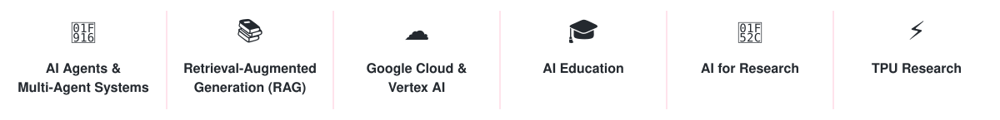
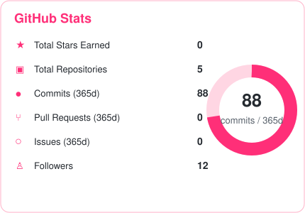
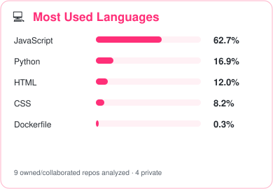
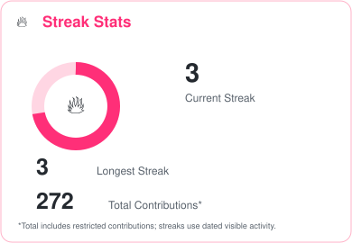
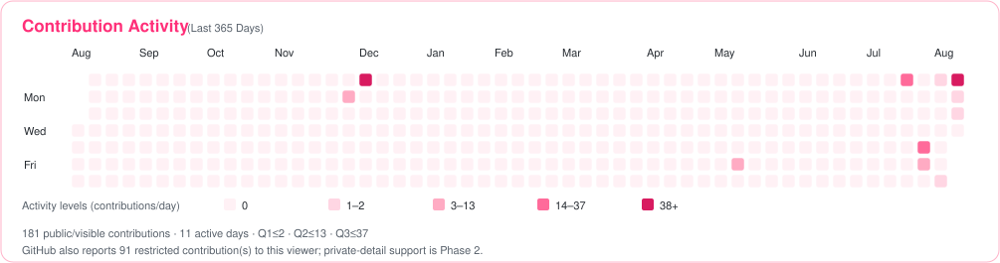
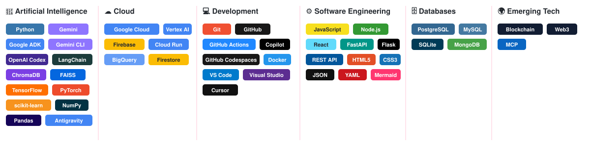
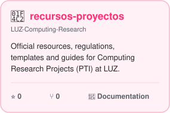

  

# Hi, I'm Yaskelly Yedra

Professor • Researcher • Google Developer Group Organizer

Helping students, researchers, and developers build intelligent systems with AI and Google Cloud.

  
  
  
  
  
  

  
  
  

### 📈 Contribution Activity

<a href="https://github.com/yaskelly?tab=repositories"><strong>View more repositories →</strong></a>

<!-- YOUTUBE:START -->

  
  
  

<!-- YOUTUBE:END -->

## 🌎 Community

Google Developer Groups

Women Techmakers

Google Cloud Innovators

<!--
**yaskelly/yaskelly** is a ✨ _special_ ✨ repository because its `README.md` (this file) appears on your GitHub profile.
-->
